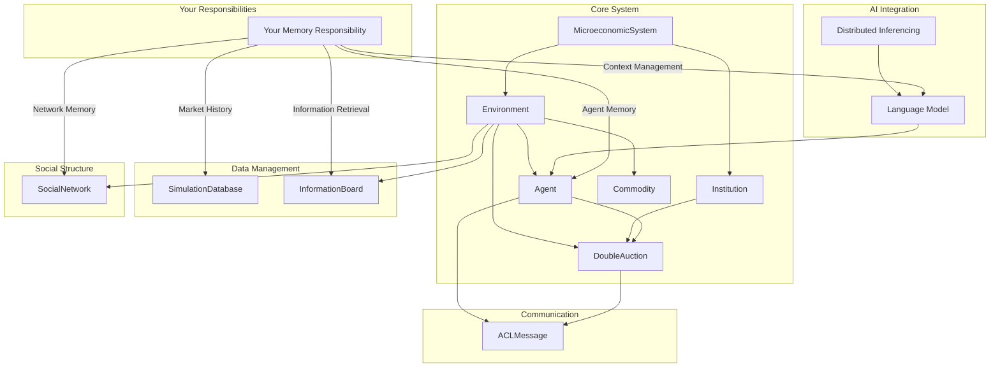

```mermaid
graph TD
    MS[MicroeconomicSystem]
    E[Environment]
    I[Institution]
    A[Agent]
    C[Commodity]
    DA[DoubleAuction]
    ACL[ACLMessage]
    SD[SimulationDatabase]
    IB[InformationBoard]
    SN[SocialNetwork]
    LM[Language Model]
    DI[Distributed Inferencing]

    YM[Your Memory Responsibility]
    
    MS --> E
    MS --> I
    E --> A
    E --> C
    E --> DA
    E --> IB
    E --> SN
    I --> DA
    A --> ACL
    A --> DA
    DA --> ACL
    LM --> A
    DI --> LM

    YM --> |Agent Memory|A
    YM --> |Market History|SD
    YM --> |Information Retrieval|IB
    YM --> |Network Memory|SN
    YM --> |Context Management|LM
    
    subgraph Your Responsibilities
        YM
    end

    subgraph Core System
        MS
        E
        I
        A
        C
        DA
    end

    subgraph Communication
        ACL
    end

    subgraph Data Management
        SD
        IB
    end

    subgraph Social Structure
        SN
    end

    subgraph AI Integration
        LM
        DI
    end
```

