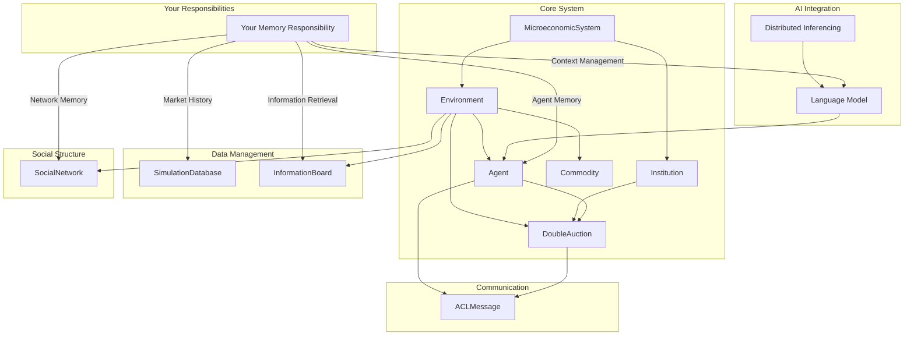

Build a working single agent to build up a AgentMemory framework to refine for scale. 
Work in with other modules db preferences. 

Initial Considerations:

- conserve tokens
  
    - find the most robust but concise instruction language for context acquistion
    - use smart context windows
    - fast low compute search fall back for out of range memory recall

- tools

    - embeddings, indexing, db of choice, search methods (keyword indexing, graph db, semantic), chunking methods

- step based timeline considerations
  
    -  what resolution context per 'step'
    -  relevance of 'context' on agents reasoning trejectory
    -  how many turns in a 'step' for the agent, 0-shot or multiturn CoT, etc

- will the chosen prompt schema, token limit, retrieved context 'work' on the smallest llms and on big dog llms
  
    - style and formatting will affect llm flow

- llm as judge
    
    - consider how we'll score relevance
    - is the context ingestion stage 0-shot or multiturn etc 
  
# MarketAgents Memory Implementation: To-Do List

1. **Agent Memory Implementation**
   - Create toy Agent w/ `AgentMemory` class with attributes: `inner_monologue`, `finance_history`, `social_history`, `activity_log`
   - Develop methods to add and retrieve entries for each attribute

2. **Market History**
   - Implement `toyMarketHistory` class within `toySimulationDatabase` while waiting on framework components
   - Develop methods to store and retrieve market data
   - Anticipate data structures for price and trade histories

3. **Information Board**
   - Implement `toyInformationBoard`
   - Develop methods for posting and retrieving information
   - Create a relevance scoring system for information retrieval

4. **Social Network Memory**
   - Implement `SocialNetwork` class
   - Develop methods to store and retrieve agent connections, graphing
   - Create network memory update mechanisms

5. **Language Model Integration**
   - Set up simple testing interface for language model, use openai format for cross compatibility while cooking
   - Implement context management for interactions within a constructed `contextPrompt`
   - Prompt schema, reasoning chains, steps

6. **Memory Integration and Testing**
   - Integrate `AgentMemory`, `toyMarketHistory`, `toyInformationBoard`, `toySocialNetwork`, and language model components
   - Build and experiment on local toy demos
   - Create logging and debugging tools for memory operations

7. **Refinement and Documentation**
   - Refine memory retrieval (resolution, methods, embeddings and indexing)
   - Implement memory compression or summarization techniques (long term memory recall using compressed recall)
   - Document all memory-related classes and methods
  
8. **Output**
   - A functioning abstraction for context ingestion for a single agent that can now scale and work in a multi agent context and drop-in with other modules builds.

===

# Market Agents Memory Implementation:
First two weeks.

## Setup and Schema
- [ ] Discuss with Atakan `BoardMessage` and Int `ACL` I/O
- [ ] Discuss the `BoardMessage` schema on top of `ACLMessage`
- [ ] Build a top decided database (SQLite with sqlite-vec or PostgreSQL)
- [ ] Get grounded in Iriden's pydantic framework expectations

## Agent Memory and Market History
- [ ] Create `AgentMemory` class with basic attributes
  - Core decision: Agree on structure for `AgentMemory` (e.g., dictionary-based for flexibility)
- [ ] Implement methods to add and retrieve entries for each `AgentMemory` attribute
- [ ] Implement `toyMarketHistory` class
  - Core decision: Use pandas for data manipulation
- [ ] Develop methods to store and retrieve market data

## Information Board
- [ ] Develop a `toyInformationBoard` class while we all cook
- [ ] Implement `add_post(post: BoardMessage)` function
- [ ] Implement `get_all_posts` function with filtering
- [ ] Implement `get_posts_by_title` function
- [ ] Implement `get_relevant_posts(relevant_topics: List[str]): List[BoardMessage]` function
  - Core decision: Implement vector db + (optional) reranker for retrieval
  - [ ] (Optional) Add step-based filtering
  - [ ] (Optional) Include "later post is better" logic
- [ ] (Optional) Implement `clear_board`/`reset_board` function

## Social Network
- [ ] Create a toy `SocialNetwork` class
  - Core decision: Thinking about graphing libraries, uses
- [ ] Develop methods to store and retrieve agent connections
- [ ] Create step based queue network memory update mechanisms

## Language Model Integration
- [ ] Set up language model testing interface
  - Core decision: Use OpenAI-compatible format for cross-compatibility
- [ ] Implement context management for LM interactions
- [ ] Develop prompt schema and reasoning chains
  - Core decision: Agree on prompting strategy (e.g., few-shot prompting)

## Memory Integration and Testing
- [ ] Integrate `AgentMemory`, `toyMarketHistory`, `toyInformationBoard`, `SocialNetwork`, and language model components
- [ ] Create logging and debugging tools
- [ ] Implement memory compression or summarization techniques
  - Core decision: Decide on summarization method for long-term memory
- [ ] Refine memory retrieval methods
  - Core decision: Finalize semantic search implementation using sentence embeddings

## Testing and Quality Assurance
- [ ] Set up end-to-end basic functionality testing
- [ ] Test through vibes basic simulation loop

## Documentation and Demo
- [ ] Document all memory-related classes and methods
- [ ] Create a simple demo showcasing the integrated system

## Collaboration and Review
- [ ] Schedule and conduct brief daily check-ins to discuss progress and challenges

## Notes
- Focus on token conservation throughout implementation
- Aim for compatibility with both small and large language models
- Prioritize simplicity and modularity for easy scaling to multi-agent contexts
- Ensure close coordination on Information Board implementation, maintaining compatibility with `AgentMemory` and other components
