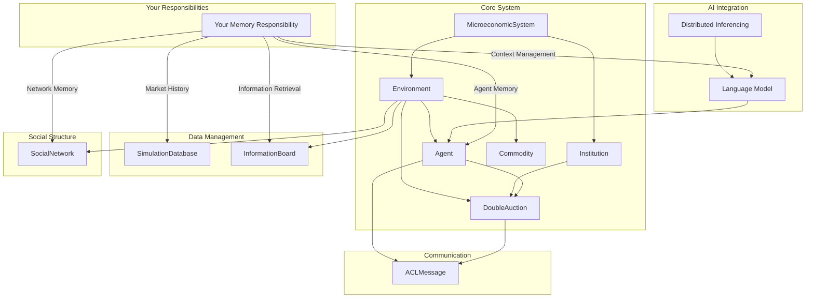

Build a working single agent to build up a AgentMemory framework to refine for scale. 
Work in with other modules db preferences. 

# MarketAgents Memory Implementation: To-Do List

1. **Agent Memory Implementation**
   - Create toy Agent w/ `AgentMemory` class with attributes: `inner_monologue`, `finance_history`, `social_history`, `activity_log`
   - Develop methods to add and retrieve entries for each attribute

2. **Market History**
   - Implement `toyMarketHistory` class within `toySimulationDatabase` while waiting on framework components
   - Develop methods to store and retrieve market data
   - Anticipate data structures for price and trade histories

3. **Information Board**
   - Implement `toyInformationBoard`
   - Develop methods for posting and retrieving information
   - Create a relevance scoring system for information retrieval

4. **Social Network Memory**
   - Implement `SocialNetwork` class
   - Develop methods to store and retrieve agent connections, graphing
   - Create network memory update mechanisms

5. **Language Model Integration**
   - Set up simple testing interface for language model, use openai format for cross compatibility while cooking
   - Implement context management for interactions within a constructed `contextPrompt`
   - Prompt schema, reasoning chains, steps

6. **Memory Integration and Testing**
   - Integrate `AgentMemory`, `toyMarketHistory`, `toyInformationBoard`, `toySocialNetwork`, and language model components
   - Build and experiment on local toy demos
   - Create logging and debugging tools for memory operations

7. **Refinement and Documentation**
   - Refine memory retrieval (resolution, methods, embeddings and indexing)
   - Implement memory compression or summarization techniques (long term memory recall using compressed recall)
   - Document all memory-related classes and methods
  
8. **Output**
   - A functioning abstraction for context ingestion for a single agent that can now scale and work in a multi agent context and drop-in with other modules builds.
