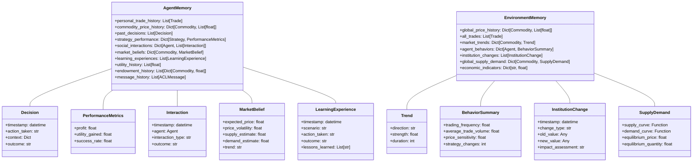

```mermaid
classDiagram
    class AgentMemory {
        +personal_trade_history: List[Trade]
        +commodity_price_history: Dict[Commodity, List[float]]
        +past_decisions: List[Decision]
        +strategy_performance: Dict[Strategy, PerformanceMetrics]
        +social_interactions: Dict[Agent, List[Interaction]]
        +market_beliefs: Dict[Commodity, MarketBelief]
        +learning_experiences: List[LearningExperience]
        +utility_history: List[float]
        +endowment_history: List[Dict[Commodity, float]]
        +message_history: List[ACLMessage]
    }

    class Decision {
        +timestamp: datetime
        +action_taken: str
        +context: Dict
        +outcome: str
    }

    class PerformanceMetrics {
        +profit: float
        +utility_gained: float
        +success_rate: float
    }

    class Interaction {
        +timestamp: datetime
        +agent: Agent
        +interaction_type: str
        +outcome: str
    }

    class MarketBelief {
        +expected_price: float
        +price_volatility: float
        +supply_estimate: float
        +demand_estimate: float
        +trend: str
    }

    class LearningExperience {
        +timestamp: datetime
        +scenario: str
        +action_taken: str
        +outcome: str
        +lessons_learned: List[str]
    }

    class EnvironmentMemory {
        +global_price_history: Dict[Commodity, List[float]]
        +all_trades: List[Trade]
        +market_trends: Dict[Commodity, Trend]
        +agent_behaviors: Dict[Agent, BehaviorSummary]
        +institution_changes: List[InstitutionChange]
        +global_supply_demand: Dict[Commodity, SupplyDemand]
        +economic_indicators: Dict[str, float]
    }

    class Trend {
        +direction: str
        +strength: float
        +duration: int
    }

    class BehaviorSummary {
        +trading_frequency: float
        +average_trade_volume: float
        +price_sensitivity: float
        +strategy_changes: int
    }

    class InstitutionChange {
        +timestamp: datetime
        +change_type: str
        +old_value: Any
        +new_value: Any
        +impact_assessment: str
    }

    class SupplyDemand {
        +supply_curve: Function
        +demand_curve: Function
        +equilibrium_price: float
        +equilibrium_quantity: float
    }

    AgentMemory -- Decision
    AgentMemory -- PerformanceMetrics
    AgentMemory -- Interaction
    AgentMemory -- MarketBelief
    AgentMemory -- LearningExperience
    EnvironmentMemory -- Trend
    EnvironmentMemory -- BehaviorSummary
    EnvironmentMemory -- InstitutionChange
    EnvironmentMemory -- SupplyDemand
```
